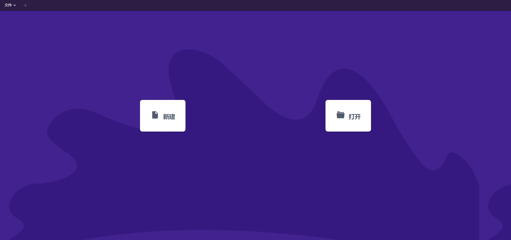
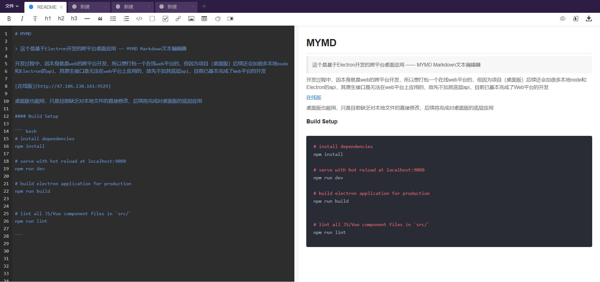

# MYMD

> 这个是基于Electron开发的跨平台桌面应用 —— MYMD Markdown文本编辑器


因本身就是web的跨平台开发，所以也打包了一个在线版，在线与桌面版稍有不同，在线版无法对本地文件直接更改，而桌面版可以，因为用了些原生（node）的api

我闲再开一个web分支太麻烦, 故直接在项目另开了一个组件，修改对应代码，即可启用在线web和桌面版不同组件。

```
// 注释其中一句
// import content from '@/pages/home/content'

import content from '@/pages/home/webContent'

```
*window平台安装程序 [下载](http://coding-net-production-file-1257242599.cos.ap-shanghai.myqcloud.com/b6f1d1f0-b369-11e9-9668-73b7a72c064a.exe?sign=q-sign-algorithm%3Dsha1%26q-ak%3DAKIDay83lFmaS6Y4LTdzMVO1SdZOyJSNOYpr%26q-sign-time%3D1564560389%3B1564563989%26q-key-time%3D1564560389%3B1564563989%26q-header-list%3D%26q-url-param-list%3Dresponse-content-disposition%3Bresponse-expires%26q-signature%3D003995dc140dc293903d205d75f9f8ba33a3c4dc&response-content-disposition=attachment%3Bfilename%3DMYMD_Setup.exe&response-expires=Fri%2C%2002%20Aug%202019%2020%3A06%3A29%20GMT) 

[在线版](http://47.106.130.141:9529)





#### Build Setup

``` bash
# install dependencies
npm install

# serve with hot reload at localhost:9080
npm run dev

# build electron application for production
npm run build


# lint all JS/Vue component files in `src/`
npm run lint

```
