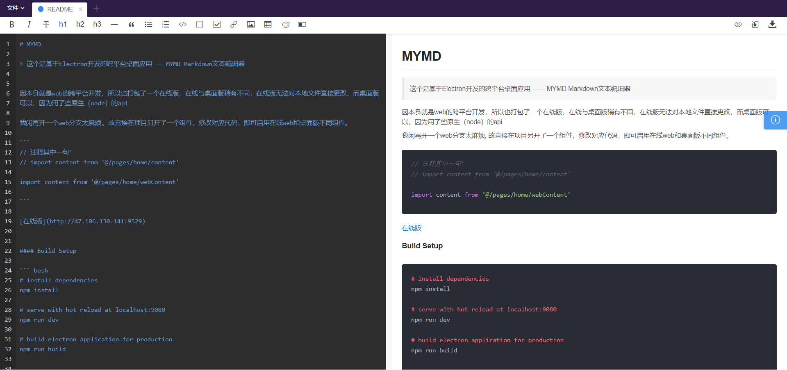

# MYMD

> 这个是基于Electron开发的跨平台桌面应用 —— MYMD Markdown文本编辑器


因本身就是web的跨平台开发，所以也打包了一个在线版，在线与桌面版稍有不同，在线版无法对本地文件直接更改，而桌面版可以，因为用了些原生（node）的api

我闲再开一个web分支太麻烦, 故直接在项目另开了一个组件，修改对应代码，即可启用在线web和桌面版不同组件。

```
// 注释其中一句
// import content from '@/pages/home/content'

import content from '@/pages/home/webContent'

```

[在线版](http://47.106.130.141:9529)




#### Build Setup

``` bash
# install dependencies
npm install

# serve with hot reload at localhost:9080
npm run dev

# build electron application for production
npm run build


# lint all JS/Vue component files in `src/`
npm run lint

```
