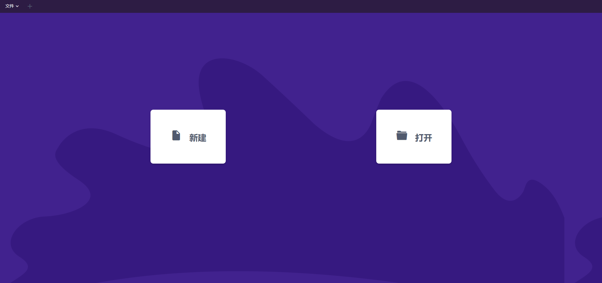

# MYMD

> 这个是基于Electron开发的跨平台桌面应用 —— MYMD Markdown文本编辑器


开发过程中，因本身就是web的跨平台开发，所以想打包一个在线web平台的，但因为项目（桌面版）后续还会加很多本地node和Electron的api，其原生接口是无法在web平台上应用的，故先不加其底层api，目前已基本完成了Web平台的开发

[在线版](http://47.106.130.141:9529)




桌面版也能用，只是目前缺乏对本地文件的直接修改，后续将完成对桌面版的底层应用

#### Build Setup

``` bash
# install dependencies
npm install

# serve with hot reload at localhost:9080
npm run dev

# build electron application for production
npm run build


# lint all JS/Vue component files in `src/`
npm run lint

```
